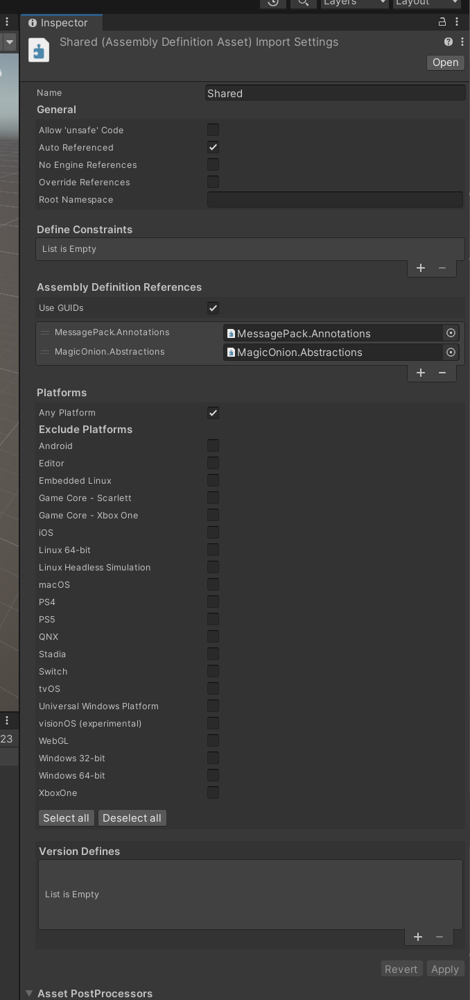

# 概要
MagicOnion を GCP にデプロイします

デプロイは GCP Deployment Manager を使います。

[gcloud CLI をインストールする  |  Google Cloud CLI のドキュメント](https://cloud.google.com/sdk/docs/install?hl=ja)

[gcloud CLI の初期化  |  Google Cloud CLI のドキュメント](https://cloud.google.com/sdk/docs/initializing?hl=ja#whats_next)


[GCPを使ってHTTPSのウェブサイトを公開する（前編）](https://zenn.dev/knockknock/articles/10aa24fde47c45)


# Dockerイメージのpush
## gcloud sdk のセットアップ
[gcloud CLI をインストールする  |  Google Cloud CLI のドキュメント](https://cloud.google.com/sdk/docs/install?hl=ja#supported_python_versions)

## Docker Hub リモートリポジトリの作成

[クイックスタート: Docker Hub リモート リポジトリを作成する  |  Artifact Registry のドキュメント  |  Google Cloud](https://cloud.google.com/artifact-registry/docs/repositories/create-dockerhub-remote-repository?hl=ja)

### Dockerイメージのビルド&プッシュ
docker build -t asia-northeast1-docker.pkg.dev/fuuro-409604/onisync/onisync:0.01 -f OniSync.Server/Dockerfile .

docker push asia-northeast1-docker.pkg.dev/fuuro-409604/onisync/onisync:0.01




```
gcloud compute instances create-with-container instance-test --project=fuuro-409604 --zone=us-central1-a --machine-type=n1-standard-1 --service-account=840485945008-compute@developer.gserviceaccount.com --container-image=asia-northeast1-docker.pkg.dev/fuuro-409604/onisync/onisync:0.01

```


# デプロイメントマネージャーからデプロイ

gcloud deployment-manager deployments create onisync-deploy --config instance-template.yaml